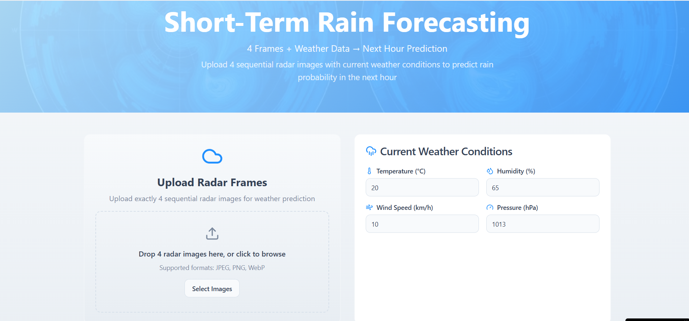

# 🌦️ Weather Prediction using Deep Learning

This project predicts the **next-hour weather conditions** (temperature, humidity, pressure, etc.) based on the **previous hour’s data** using a deep learning model.  
We also built a **frontend web app** to make predictions easy and interactive.

---

## 🚀 Live Demo
👉 [Try the app here](https://sky-frame.lovable.app)

## 📊 Sample Output
Here’s the frontend of the moel

---

## 📌 Features
- Predicts **next-hour weather** from historical radar-based data  
- Uses **Artificial Neural Networks (ANN)** and **Deep Learning** models  
- Trained on our **own custom dataset**: [Radar Dataset](https://www.kaggle.com/datasets/rohinigaddam/radderdataset1)  
- **Frontend UI** for real-time user input and predictions  
- Visualizes predicted vs. actual weather values  

---

## 🛠️ Tech Stack
- **Python**, **TensorFlow/Keras**, **NumPy**, **Pandas**, **Matplotlib**
- **Frontend**: React / Lovable App platform
- **Deployment**: Lovable hosting  

---
